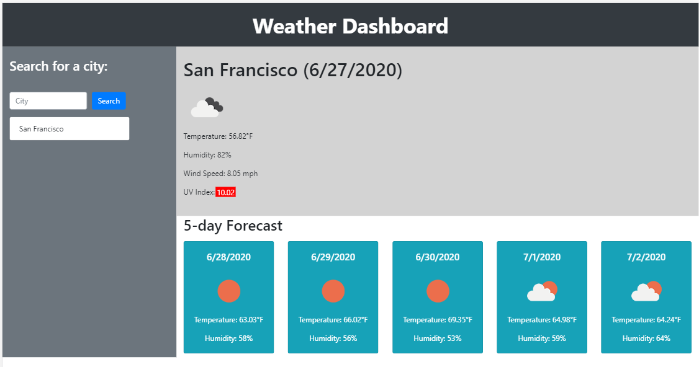

# Weather Dashboard

## Background
The objective of this exercise was to create utilize a server side API to build a Weather Dashboard with dynamically updated HTML and CSS.

Acceptance criteria is as follows:

```
GIVEN a weather dashboard with form inputs
WHEN I search for a city
THEN I am presented with current and future conditions for that city and that city is added to the search history
WHEN I view current weather conditions for that city
THEN I am presented with the city name, the date, an icon representation of weather conditions, the temperature, the humidity, the wind speed, and the UV index
WHEN I view the UV index
THEN I am presented with a color that indicates whether the conditions are favorable, moderate, or severe
WHEN I view future weather conditions for that city
THEN I am presented with a 5-day forecast that displays the date, an icon representation of weather conditions, the temperature, and the humidity
WHEN I click on a city in the search history
THEN I am again presented with current and future conditions for that city
```

## Site Pictures


## Approach

There were a few key areas to focus on in this project:
1) Access and parse server side API data
2) Dynamically update HTML and CSS 


### Accessing and parsing server side API data

For this project, the OpenWeather API was utilized for accessing weather data.  As not required fields were included in any single data collection, both the Current Weather Data and One Call API data collections were utilized.

The below snippet shows the Current Weather Data collection accessed first.  Latitude and longitude data was parsed from this collection and then utilized to access additional data in the One Call API collection.

```
 // accesses the Current Weather Data collection
            var queryURL = "https://api.openweathermap.org/data/2.5/weather?q=" + cityName + "&units=imperial&appid="+APIke

            $.ajax({
                url: queryURL,
                method: "GET"
            }).then(function (response) {
                console.log(response);
                var name = response.name;
                var icon = response.weather[0].icon;
                var iconURL = "https://openweathermap.org/img/wn/" + icon + "@2x.png"
                $("#iconDisplay").attr("src", iconURL);
                var windSpeed = response.wind.speed;
                $("#windSpeedDisplay").text("Wind Speed: " + windSpeed + " mph")
                var humidity = response.main.humidity;
                $("#humidityDisplay").text("Humidity: " + humidity + "%")
                var temperature = response.main.temp;
                $("#tempDisplay").text("Temperature: " + temperature + "\xB0" + "F")
                lat = response.coord.lat;
                lon = response.coord.lon;
                console.log("lat: " + lat);
                console.log("lon: " + lon);
                // Accesses the One Call API data collection with latitude and longitude from above
                var query2URL = "https://api.openweathermap.org/data/2.5/onecall?lat=" + lat + "&lon=" + lon + "&" +
                    "exclude=minutely,hourly&units=imperial&appid="+APIkey;
```

### Dynamic updates to HTML and CSS

The acceptance criteria required several page elements to be dynamically updated. Below is one example of how UV index is parsed and then displayed on the page with a color background illustrating the level of severity:

```
var uvi = response.current.uvi;
var uviDisplay = $("<div>");
uviDisplay.text(uvi);
uviDisplay.addClass("text-center");
    if (uvi < 3) {
        uviDisplay.attr("style", "background-color:green;width: 43px; height: 22px; position: absolute; bottom: 11%; left: 7.5%; color: white;");
    }
    else if (uvi >= 3 && uvi < 6) {
        uviDisplay.attr("style", "background-color:yellow;width: 43px; height: 22px; position: absolute; bottom: 11%; left: 7.5%; color: blue;");
    }
    else if (uvi >= 6 && uvi < 8) {
        uviDisplay.attr("style", "background-color:orange;width: 43px; height: 22px; position: absolute; bottom: 11%; left: 7.5%; color: white;");
    }
    else if (uvi >= 8 && uvi < 11) {
        uviDisplay.attr("style", "background-color:red;width: 43px; height: 22px; position: absolute; bottom: 11%; left: 7.5%; color: white;");
    }
    else {
        uviDisplay.attr("style", "background-color:purple;width: 43px; height: 22px; position: absolute; bottom: 11%; left: 7.5%; color: white;");
    }
    $("#todayWeather").append(uviDisplay)
```

## Built With

* [HTML](https://developer.mozilla.org/en-US/docs/Web/HTML)
* [CSS](https://developer.mozilla.org/en-US/docs/Web/CSS)
* [Bootstrap](https://getbootstrap.com/)
* [JS](https://developer.mozilla.org/en-US/docs/Web/JavaScript)
* [jquery](https://jquery.com/)
* [OpenWeather](https://openweathermap.org/api)

## Deployed Link

* [See Live Site](https://cofchips.github.io/weather_dashboard/)


## Authors

* **CHRISTOPHER LEE** 

- [Link to Github](https://github.com/CofChips)
- [Link to LinkedIn](https://www.linkedin.com/in/christophernlee/)

## Acknowledgments